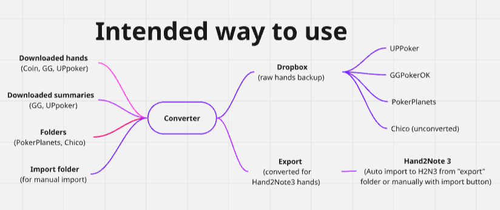

# HHConverter

Convert tournament and cash (CoinPoker) hand histories from multiple poker rooms into formats suitable for **Hand2Note 3**.

Supports **PokerPlanets**, **GGPokerOK**, **UPpoker**, and **CoinPoker**, with optional Dropbox backup and **Chico** hands copy.


Usage scenario author advice: hands from different sources are processed and stored in two forms: raw copy in Dropbox folder and converted ones in Export folder. Source folders are cleared from processed files after that so you don't have third copy of all your hands. Set auto import in H2N3 config to pick up files from export folder automatically. Do not use H2N3's auto import if you don't want your cash games to get into the Dropbox as it will make separate copies of converted ones too with "Archive hand histories into directory" enabled! Use manual import to Hand2Note3 then.

[Discord](https://discord.gg/AKRS7YFaw)

## Features

- GUI (`HHConverter.exe` or `python -m converter.gui`) and CLI (`python -m converter`)
- Per-room conversion to Hand2Note-compatible PokerStars / Coin-module layouts
- **CoinPoker** tournaments and cash (multi-table name tracking; optional “Coin as PS” export)
- **PokerPlanets** recursive folder watch (client date/table subfolders)
- Hand ID namespacing per room to avoid collisions in one database
- Stack-based opponent name continuity (tournaments + Coin cash sessions)
- Optional Dropbox backup (raw PP/GG/UP/Chico)
- **Import from folders** — watch PokerPlanets + Downloads for new files only
- **First-run date** — Downloads auto-import ignores files older than the first Convert day (avoids re-loading hands already in Hand2Note); older hands can still be placed in Import manually
- Optional clear Import after convert; optional clear of **only processed** watched-folder files after Dropbox copy (Chico originals are never deleted)
- Multilingual in-app help (EN / RU / UK / KK / FR / ES / PL)

## Requirements

- **Python 3.11+** (for running from source)
- **Windows** (for the standalone `.exe` build)
- [tzdata](https://pypi.org/project/tzdata/) on Windows (included in build)

## Quick start (from source)

```powershell
cd Converter
python -m pip install -e .
copy config.example.json config.json
# Edit config.json or use the GUI Settings dialog
python -m converter.gui
```

CLI:

```powershell
python -m converter
python -m converter --config config.json -q
```

On first GUI launch, `config.json` is created next to the app if missing.

## Configuration

Copy `config.example.json` to `config.json`:

| Field | Description |
|-------|-------------|
| `import_path` | Folder with raw `.txt` / `.zip` hand histories |
| `export_path` | Converted output folder |
| `dropbox_base_path` | Dropbox root for mirrored hands (empty = off) |
| `dropbox_mode` | `"original"` or `"none"` |
| `chico_import_path` | Chico `.txt` folder to copy unchanged (or `null`) |
| `clear_import_after_convert` | Delete `*.txt` / `*.zip` under Import after a successful run |
| `coin_as_ps` | Export CoinPoker as PokerStars-style (for H2N without Pro/Asia) |
| `import_from_folders` | Also watch PokerPlanets / Downloads for new files |
| `poker_planets_folder` | PokerPlanets HH root (recursive) |
| `downloads_folder` | Downloads folder for GG/UP/Coin zips and txt |
| `clear_folders_after_import` | With Dropbox on: delete **processed** watched files only (not Chico) |
| `player_alias` | Hero nickname in GG / UP / Coin output |

First-run date is stored in `_internal/import_watch_state.json` (`first_run_date`) on the first Convert.

## Supported rooms

| Room | Input header | Notes |
|------|----------------|-------|
| PokerPlanets | `PokerPlanets Hand #` | PokerStars-style export |
| GGPokerOK | `Poker Hand #TM5730…` | Numeric TM ids |
| UPpoker | `Poker Hand #TM0…` | Hex TM ids |
| CoinPoker | `CoinPoker Hand #` | Tournaments + cash; H2N Coin / optional PS |

Chico files are copied as-is when `chico_import_path` is set (not converted).

## Disclaimer

This project is not affiliated with Hand2Note, PokerStars, or any poker room. Use at your own risk. Comply with the terms of service of software and poker sites you use.

## License

[GNU General Public License v3.0](LICENSE) — Copyright (c) 2026 Sem By.
